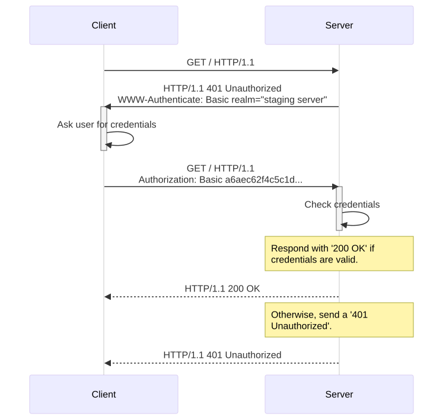

# WWW-Authenticate



tak działa dla każdego schematu uwierzytelniania

## Apache

```bash
dnf install -y httpd mod_ssl

openssl req -x509 -newkey rsa:2048 -nodes -days 365 \
  -keyout /etc/pki/tls/private/vm1.network.key \
  -out /etc/pki/tls/certs/vm1.network.crt \
  -subj "/CN=vm1.network" \
  -addext "subjectAltName=DNS:vm1.network"

cat << EOF > /etc/httpd/conf/httpd.conf
<Location "/">
	AuthType basic
	AuthName "private"
	AuthUserFile .htaccess
	Require valid-user
</Location>
EOF

htpasswd -cb /etc/httpd/.htaccess admin admin
```

```bash
curl --cacert vm1.network.crt -u admin:admin https://vm1.network
```
## Analiza

Uwaga mitmproxy do wyjebania
- wymagane męczące ręczne uwierzytelnianie gdy nasłuchuje na adresie innym niż localhost
- trzeba dużo montować (bez montowania certy się zmieniają)
- trzeba uruchomić w trybie internatykwnym

```bash
touch sslkeylogfile.txt
chmod 646 sslkeylogfile.txt
podman run -it --name mitmproxy \
  -p 8080:8080 \
  -p 8081:8081 \
  -e SSLKEYLOGFILE="/home/mitmproxy/.sslkeylog/sslkeylogfile.txt" \
  -v mitm-data:/home/mitmproxy/.mitmproxy:Z \
  -v ~/.sslkeylog:/home/mitmproxy/.sslkeylog:Z \
  mitmproxy/mitmproxy mitmweb \
    --web-host 0.0.0.0 \
    --ssl-insecure \
    --set web_password=admin
```

## Słownik
- resource authentication
- proxy authentication